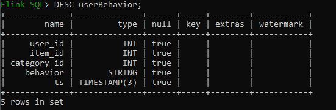
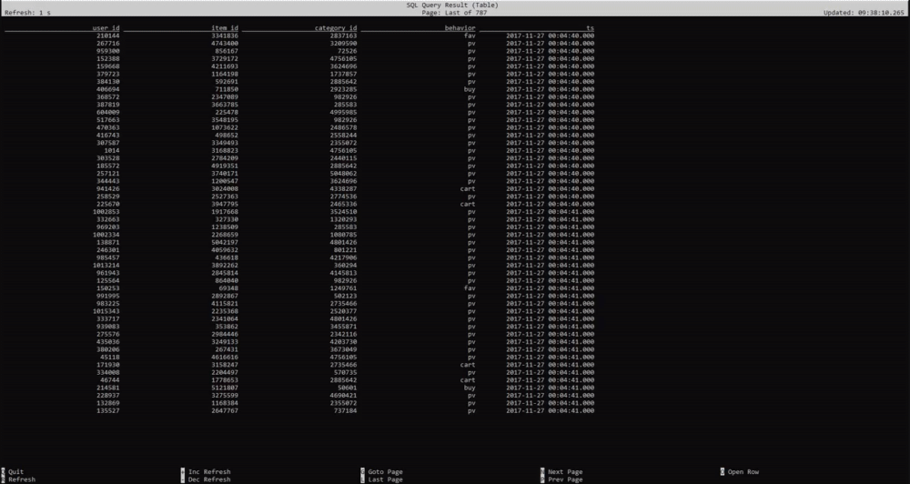
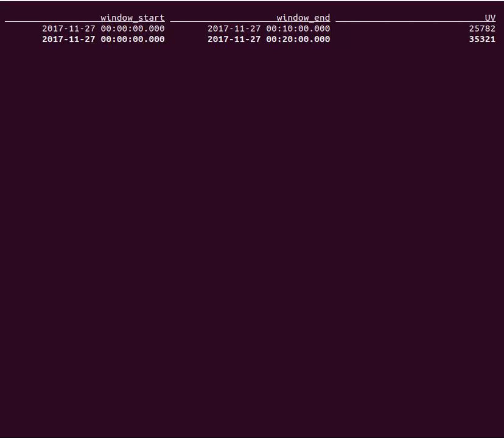
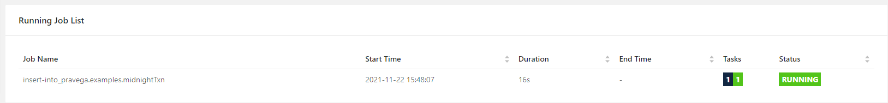
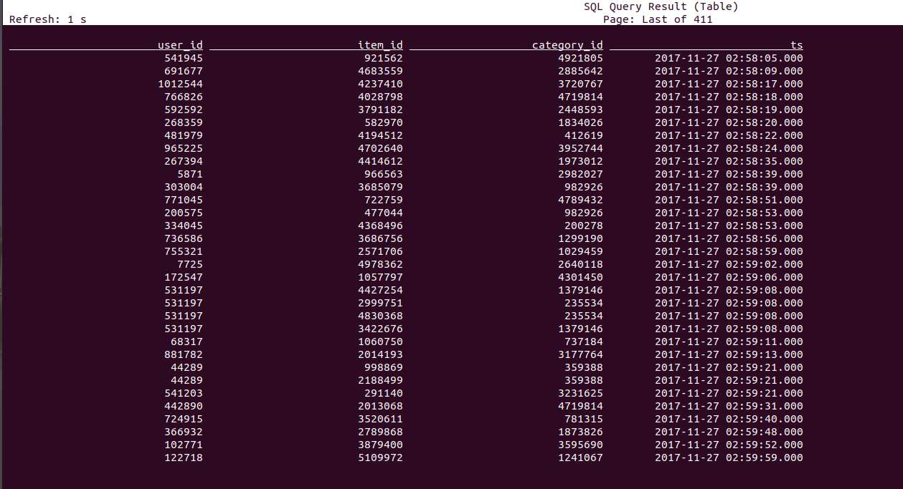

<!--
Copyright Pravega Authors.

Licensed under the Apache License, Version 2.0 (the "License");
you may not use this file except in compliance with the License.
You may obtain a copy of the License at

    http://www.apache.org/licenses/LICENSE-2.0

Unless required by applicable law or agreed to in writing, software
distributed under the License is distributed on an "AS IS" BASIS,
WITHOUT WARRANTIES OR CONDITIONS OF ANY KIND, either express or implied.
See the License for the specific language governing permissions and
limitations under the License.
-->
# Flink Catalog Demo

In this demo we will show how Flink SQL is using Pravega as an external, persistent catalog and processing data from Pravega with the help of Pravega Schema Registry Service.
All exercises are performed in the Flink SQL CLI, 
and the entire process uses standard SQL syntax, without a single line of Java/Scala code or IDE installation.

This demo is inspired by @wuchong's excellent work. [Flink-SQL demo](https://flink.apache.org/2020/07/28/flink-sql-demo-building-e2e-streaming-application.html)

## Background
Flink Catalogs provide metadata such as databases, tables, partitions, views, functions and information needed to access data stored 
in a database or other external systems. It provides a unified API for managing metadata and making it accessible from the Table API and SQL Queries. 
A Catalog enables users to reference existing metadata in their data systems and automatically maps them to Flink's corresponding metadata.
Pravega `scope` is mapped to Flink catalog `database` while Pravega `stream` is mapped to Flink catalog `table` automatically
so that we don't need to manually rewrite DDLs to create tables.
It let us clearly separate making the data available from consuming it. That separation improves productivity, security, and compliance when working with data.

[Pravega](https://github.com/pravega/pravega), as a storage service, uses terms such as streams and scopes for managing streaming data, but it does not have the concepts of tables and databases.
With the help of [Pravega Schema Registry](https://github.com/pravega/schema-registry), which is built on Pravega to store and manage schemas for data stored in Pravega streams, 
it is feasible to map Pravega streams to Flink tables as the following table shows:

| Flink Catalog terms                  | Pravega terms     |
|--------------------------------------|-------------------|
| catalog name (defined in Flink only) | N/A               |
| database name                        | scope name        |
| table name                           | stream name       |

To use Pravega Catalog, users can use SQL DDL or Java/Scala programatically to create and register Pravega Flink Catalog. You can find more details about Pravega Catalog 
[here](https://github.com/pravega/flink-connectors/blob/master/documentation/src/docs/catalog.md).

## Prerequsites

- Docker and docker compose installed.


### Prepare the Demo Environment

The components required in this demo are all managed in containers, we have already provided `datagen` and `sql-client` images for the demo. 
You can also choose to build these two images on your own following the next steps.
If you don't want to dive into the detail of the data ingestion, just jump to [The Demo](#the-demo).

### Get the data
The dataset we are using is from the [Alibaba Cloud Tianchi public dataset](https://tianchi.aliyun.com/dataset/dataDetail?dataId=649). 
It contains the user behavior on the day of November 27, 2017 (behaviors include “click”, “like”, “purchase” and “add to shopping cart” events).
Each row represents a user behavior event, with the user ID, item ID, product category ID, behavior type, and timestamp as the following table shows:

| Field         | Type      | Details                                                                                |
|---------------|-----------|----------------------------------------------------------------------------------------|
| User ID       | String    | The serialized ID that represents a user                                               |
| Item ID       | String    | The serialized ID that represents an item                                              |
| Category ID   | String    | The serialized ID that represents the category which the corresponding item belongs to |
| Behavior type | String    | Enum-type from ('pv', 'buy', 'cart', 'fav')                                            |
| Timestamp     | Timestamp | The timestamp of the behavior                                                          |

Please download the demo data from [Google Drive](https://drive.google.com/file/d/1P4BAZnpCY-knMt5HFfcx3onVjykYt3et/view?usp=sharing) and move it into the `./datagen` folder (as `./data/user_behavior.log`).

The folder will be mounted by the Docker containers.

### Build the Docker Images
Change image path to your own docker repository and build path in `docker-compose.yml` before building images.
```
docker-compose build
```

## The Demo

The components required in this demo are all managed in containers, so we will use docker-compose as our demo environment.
Our demo is running on `Flink` 1.13.1, `Pravega` 0.10.1 and `SchemaRegistry` 0.2.0.

### Container introduction

Our Docker Compose environment consists of the following containers:
- **Flink SQL Client**: used to submit queries and visualize their results.
- **Flink Cluster**: a Flink JobManager container and a Flink TaskManager container to execute queries.
- **DataGen**: the data generator. By default, it will send 1000 data per second, lasting for about 3 hours. You can also
  modify the `speedup` parameter in `docker-compose.yml` to adjust the data generating speed. It will first register the
  schema to Pravega schema registry service and then send the generated data to Pravega cluster automatically.
  We use Avro as the format for serialization, while Json is also another available format.
- **Pravega**: used as streaming data storage. Data generated by Datagen container will be sent to Pravega. 
  And the data stored in Pravega will be sent to Flink as a data source using [Pravega-Flink connector](https://github.com/pravega/flink-connectors).
  It has a default controller URI `tcp://localhost:9090` as the controller endpoints that can be directly accessed.
- **Schema Registry**: the registry service to store and manage schemas for the unstructured data stored in Pravega streams. It has a default 
  Schema Registry URI `http://schemaregistry:9092` as the service endpoint for connecting with registry client.

### Demo start

First we need to start all containers, run the following command in the directory that contains the docker-compose.yml file.
```
docker-compose up -d
```
This command automatically starts all the containers defined in the Docker Compose configuration in a detached mode. 
Run docker ps to check whether the 6 containers are running properly. You can also visit http://localhost:18081/ to see if Flink is running normally.

Then we need to enter the SQL CLI client:
```
docker-compose exec sql-client ./sql-client.sh
```
The command starts the SQL CLI client in the container. You should see the welcome screen of the CLI client:
```
                                   ▒▓██▓██▒
                               ▓████▒▒█▓▒▓███▓▒
                            ▓███▓░░        ▒▒▒▓██▒  ▒
                          ░██▒   ▒▒▓▓█▓▓▒░      ▒████
                          ██▒         ░▒▓███▒    ▒█▒█▒
                            ░▓█            ███   ▓░▒██
                              ▓█       ▒▒▒▒▒▓██▓░▒░▓▓█
                            █░ █   ▒▒░       ███▓▓█ ▒█▒▒▒
                            ████░   ▒▓█▓      ██▒▒▒ ▓███▒
                         ░▒█▓▓██       ▓█▒    ▓█▒▓██▓ ░█░
                   ▓░▒▓████▒ ██         ▒█    █▓░▒█▒░▒█▒
                  ███▓░██▓  ▓█           █   █▓ ▒▓█▓▓█▒
                ░██▓  ░█░            █  █▒ ▒█████▓▒ ██▓░▒
               ███░ ░ █░          ▓ ░█ █████▒░░    ░█░▓  ▓░
              ██▓█ ▒▒▓▒          ▓███████▓░       ▒█▒ ▒▓ ▓██▓
           ▒██▓ ▓█ █▓█       ░▒█████▓▓▒░         ██▒▒  █ ▒  ▓█▒
           ▓█▓  ▓█ ██▓ ░▓▓▓▓▓▓▓▒              ▒██▓           ░█▒
           ▓█    █ ▓███▓▒░              ░▓▓▓███▓          ░▒░ ▓█
           ██▓    ██▒    ░▒▓▓███▓▓▓▓▓██████▓▒            ▓███  █
          ▓███▒ ███   ░▓▓▒░░   ░▓████▓░                  ░▒▓▒  █▓
          █▓▒▒▓▓██  ░▒▒░░░▒▒▒▒▓██▓░                            █▓
          ██ ▓░▒█   ▓▓▓▓▒░░  ▒█▓       ▒▓▓██▓    ▓▒          ▒▒▓
          ▓█▓ ▓▒█  █▓░  ░▒▓▓██▒            ░▓█▒   ▒▒▒░▒▒▓█████▒
           ██░ ▓█▒█▒  ▒▓▓▒  ▓█                █░      ░░░░   ░█▒
           ▓█   ▒█▓   ░     █░                ▒█              █▓
            █▓   ██         █░                 ▓▓        ▒█▓▓▓▒█░
             █▓ ░▓██░       ▓▒                  ▓█▓▒░░░▒▓█░    ▒█
              ██   ▓█▓░      ▒                    ░▒█▒██▒      ▓▓
               ▓█▒   ▒█▓▒░                         ▒▒ █▒█▓▒▒░░▒██
                ░██▒    ▒▓▓▒                     ▓██▓▒█▒ ░▓▓▓▓▒█▓
                  ░▓██▒                          ▓░  ▒█▓█  ░░▒▒▒
                      ▒▓▓▓▓▓▒▒▒▒▒▒▒▒▒▒▒▒▒▒▒▒▒▒▒▒▒▒▒░░▓▓  ▓░▒█░

    ______ _ _       _       _____  ____  _         _____ _ _            _  BETA   
   |  ____| (_)     | |     / ____|/ __ \| |       / ____| (_)          | |  
   | |__  | |_ _ __ | | __ | (___ | |  | | |      | |    | |_  ___ _ __ | |_
   |  __| | | | '_ \| |/ /  \___ \| |  | | |      | |    | | |/ _ \ '_ \| __|
   | |    | | | | | |   <   ____) | |__| | |____  | |____| | |  __/ | | | |_
   |_|    |_|_|_| |_|_|\_\ |_____/ \___\_\______|  \_____|_|_|\___|_| |_|\__|

        Welcome! Enter 'HELP;' to list all available commands. 'QUIT;' to exit.


Flink SQL>
```

After that, we need to create a Pravega Catalog to access the data stored in Pravega.
In order to use Pravega Catalog, we need to add schema registry group and register the schema of your serialization format to schema registry service.
The datagen container has done these things, so the catalog can get the schema information, translate the Pravega stream into Flink table and show in the catalog.
You can check this by calling Pravega Schema Registry's REST API:
```
docker-compose exec schemaregistry curl -X GET http://localhost:9092/v1/groups/userBehavior/schemas?namespace=examples
```

Then the datagen container will send data to `userBehavior` stream in `examples` scope of Pravega. 
Pravega will send data to Flink as a data source by Pravega Flink connector. 

We run the following DDL statement in SQL CLI to create a Flink catalog that connects to Pravega and schema-registry.
We will use Avro as the format for serialization in table sink as predefined in datagen container.

```sql
CREATE CATALOG pravega WITH(
    'type' = 'pravega',                                     --Flink catalog type
    'controller-uri' = 'tcp://pravega:9090',                --Pravega controller URI
    'schema-registry-uri' = 'http://schemaregistry:9092',   --Schema-Registry service URI
    'default-database' = 'examples',                        --Flink catalog database, mapped to Pravega scope
    'serialization.format' = 'Avro'                         --data serialization format
);
```

### Show Tables
The Pravega catalog will translate the schema from schema registry service and use it to create the flink table.
We can check the tables in Pravega catalog: 
```sql
USE CATALOG pravega;
SHOW TABLES;
DESCRIBE userBehavior;
SELECT * FROM userBehavior;
```



### Use case 1: Unique Visitors (UV)

One typical use case in the online services is to calculate the cumulative unique visitors continuously, i.e. every ten minutes in one day. 
For example, the number of UV at 10:00 represents the total number of UV from 00:00 to 10:00.
This can be easily and efficiently implemented by `CUMULATE` windowing.  
You can check more about `CUMULATE` and other Windowing TVFs [here](https://nightlies.apache.org/flink/flink-docs-stable/docs/dev/table/sql/queries/window-tvf/).

In order to enrich the table with the event time and watermark information since Pravega catalog do not support
watermark, we need to extend the existing catalog table like this using [LIKE clause](https://nightlies.apache.org/flink/flink-docs-stable/docs/dev/table/sql/create/#like):
```sql
CREATE TABLE default_catalog.default_database.user_behavior (
  WATERMARK FOR ts as ts - INTERVAL '5' SECOND
) LIKE userBehavior;
```

We can have a cumulating window for 10 min step and 1 day max size and get the windows [00:00, 00:10), [00:00, 00:20),
..., [00:00, 24:00):
```sql
SELECT window_start, window_end, COUNT(DISTINCT user_id) as UV
FROM Table(
    CUMULATE(Table default_catalog.default_database.user_behavior, DESCRIPTOR(ts), INTERVAL '10' MINUTES, INTERVAL '1' DAY))
GROUP BY window_start,window_end;
```


### Use case 2: Extract-Transform-Load(ETL) pipeline

The aforementioned use case shows how we can query the data from Pravega streams. 
In addition, Pravega can also be the downstream sink to persist an SQL query output to construct an end-to-end ETL pipeline.

In the retail industry, transactions at midnight may have more fraud risks, so a typical use case would be that these transactions 
need to be filtered and persisted again for further fraud-detection analysis. 
Here we use the `INSERT INTO ... SELECT` clause to contruct an ETL pipeline to read from the data source and 
persist all the transactions between 00:00 to 03:00 into another Pravega stream.

The Pravega Catalog will first create a stream with table name in Pravega. 
Then it will convert flink table schema to schema info which can be read by Schema Registry so that this schema can be registered in
schema registry service, which will be used to write data into the Pravega stream later.
```sql
CREATE TABLE midnightTxn (
    user_id STRING,
    item_id STRING,
    category_id STRING,
    ts TIMESTAMP(3)
);
```
You can check the stream creation in Pravega by using Pravega-cli:
```
docker-compose exec pravega bin/pravega-cli stream list examples
```
Also you can check the schema registered in Schema registry by calling Schema registry REST API:
```
docker-compose exec schemaregistry curl -X GET http://localhost:9092/v1/groups/midnightTxn/schemas?namespace=examples
```
Then we write query results into table:
```sql
INSERT INTO midnightTxn
SELECT user_id, item_id, category_id, ts
FROM userBehavior
WHERE behavior = 'buy' AND HOUR(ts) <= 2;
```


You can check by querying in the sql client:
```
SELECT * FROM midnightTxn
```


### Demo stop
Finally, you can use the following command to stop all the containers after you finished the tutorial.
`docker-compose down`

## Conclusion
The demo provides some clear and practical examples of the convenience and power of catalogs, featuring an easy connection to Pravega.
It enables us to reference existing metadata in Pravega and automatically maps them to Flink's corresponding metadata easily so that
we don't have to re-write DDLs in Flink when accessing data. 
The catalog greatly simplifies steps required to get started with Flink with Pravega, and greatly enhanced user experiences.