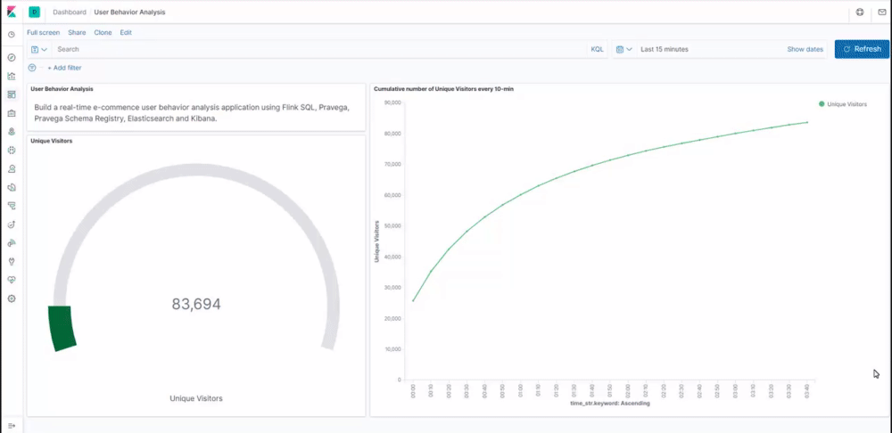
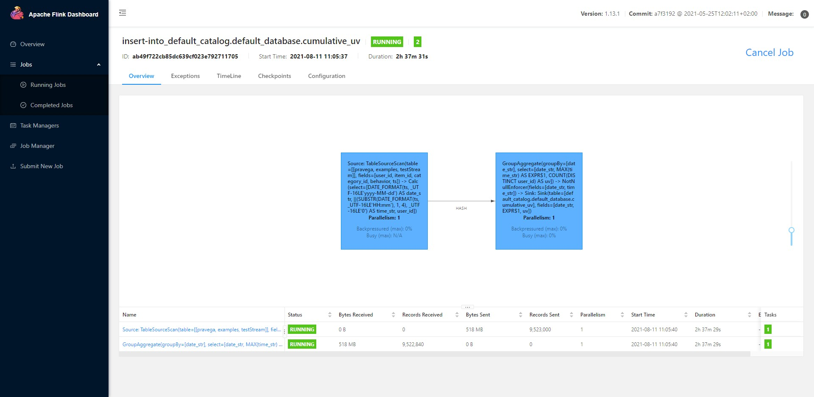
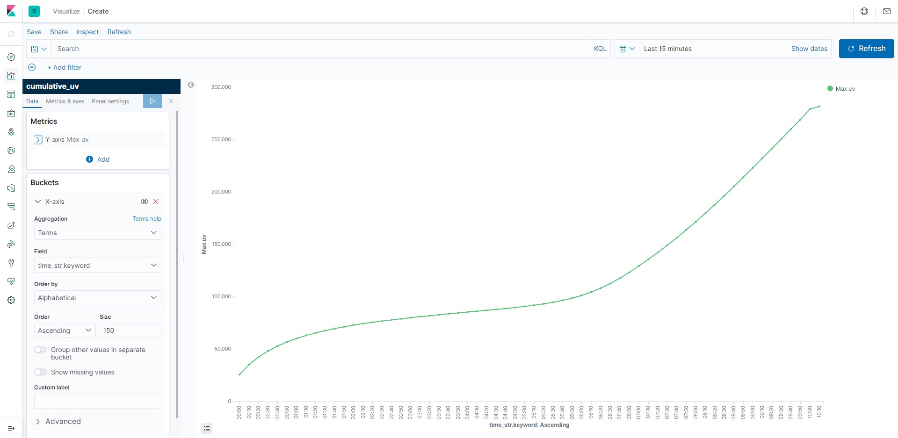

# Flink-Catalog-Demo

Demo: Streaming application with Flink Catalog and Pravega.

This demo aims to integrate Pravega, Pravega Schema Registry, Elasticsearch, Kibana with Flink SQL.
All exercises are performed in the Flink SQL CLI, 
and the entire process uses standard SQL syntax, without a single line of Java/Scala code or IDE installation.

This demo is inspired by @wuchong's excellent work. [Flink-SQL demo](https://flink.apache.org/2020/07/28/flink-sql-demo-building-e2e-streaming-application.html)

Final Result


### Prerequsites

Prepare a Linux or MacOS computer with Docker installed.

### Starting the Demo Environment

The components required in this demo are all managed in containers, so we will use docker-compose to start them. 
You can use the following docker-compose.yml file that defines the demo environment:

<details>
<summary>docker-compose.yml</summary>

```yaml
version: '2.1'
services:
  sql-client:
    image: fyang86/catalog-demo-sql-client:0.1
    depends_on:
      - pravega
      - schemaregistry
      - jobmanager
      - elasticsearch
    environment:
      FLINK_JOBMANAGER_HOST: jobmanager
      ZOOKEEPER_CONNECT: zookeeper
      ES_HOST: elasticsearch
  jobmanager:
    image: flink:1.13.1-scala_2.12
    ports:
      - "8081:8081"
    command: jobmanager
    environment:
      - |
        FLINK_PROPERTIES=
        jobmanager.rpc.address: jobmanager
  taskmanager:
    image: flink:1.13.1-scala_2.12
    depends_on:
      - jobmanager
    command: taskmanager
    environment:
      - |
        FLINK_PROPERTIES=
        jobmanager.rpc.address: jobmanager
        taskmanager.numberOfTaskSlots: 10
  pravega:
    image: fyang86/pravega:0.10.0-test1
    ports:
      - "9090:9090"
      - "12345:12345"
    command: "standalone"
  schemaregistry:
    image: pravega/schemaregistry:0.2.0
    depends_on:
      - pravega
    ports:
      - "9092:9092"
    environment:
      CONTROLLER_URL: tcp://pravega:9090
  datagen:
    image: fyang86/catalog-demo-datagen:0.1
    command: >
      sh -c "sleep 60 &&
              java -classpath /opt/datagen/datagen.jar sender --input /opt/datagen/user_behavior.log --speedup 1000 --ctrluri tcp://pravega:9090 --scmrgsturi http://schemaregistry:9092"
    depends_on:
      - pravega
      - schemaregistry
  elasticsearch:
    image: docker.elastic.co/elasticsearch/elasticsearch:7.6.0
    environment:
      - cluster.name=docker-cluster
      - bootstrap.memory_lock=true
      - "ES_JAVA_OPTS=-Xms512m -Xmx512m"
      - discovery.type=single-node
    ports:
      - "9200:9200"
      - "9300:9300"
    ulimits:
      memlock:
        soft: -1
        hard: -1
      nofile:
        soft: 65536
        hard: 65536
  kibana:
    image: docker.elastic.co/kibana/kibana:7.6.0
    ports:
      - "5601:5601"
```

</details>

The Docker Compose environment consists of the following containers:
- **Flink SQL Client**: used to submit queries and visualize their results.
- **Flink Cluster**: a Flink JobManager container and a Flink TaskManager container to execute queries.
- **DataGen**: the data generator. By default it will send 1000 data per second, lasting for about 3 hours. You can also
  modify the `speedup` parameter in `docker-compose.yml` to adjust the data generatoring speed. It will first register the
  schema to Pravega schema registry service and then send the generated data to Pravega cluster automatically.
- **Pravega**: used as streaming data storage. Data generatored by Datagen container will be sent to Pravega. 
  And the data stored in Pravega will be sent to Flink as a data source using [Pravega-Flink connector](https://github.com/pravega/flink-connectors).
- **Schema Registry**: the registry service to store and manage schemas for the unstructured data stored in Pravega streams.
- **Elasticsearch**: mainly used as a data sink.
- **Kibana**: used to visualize the data in Elasticsearch.

To start all containers, run the following command in the directory that contains the docker-compose.yml file.
```
docker-compose up -d
```
This command automatically starts all the containers defined in the Docker Compose configuration in a detached mode. 
Run docker ps to check whether the 8 containers are running properly. You can also visit http://localhost:5601/ to see if Kibana is running normally.

Finally, you can use the following command to stop all the containers after you finished the tutorial.
`docker-compose down`

### Entering the Flink SQL CLI client
To enter the SQL CLI client run:
```
docker-compose exec sql-client ./sql-client.sh
```
The command starts the SQL CLI client in the container. You should see the welcome screen of the CLI client:
```
                                   ▒▓██▓██▒
                               ▓████▒▒█▓▒▓███▓▒
                            ▓███▓░░        ▒▒▒▓██▒  ▒
                          ░██▒   ▒▒▓▓█▓▓▒░      ▒████
                          ██▒         ░▒▓███▒    ▒█▒█▒
                            ░▓█            ███   ▓░▒██
                              ▓█       ▒▒▒▒▒▓██▓░▒░▓▓█
                            █░ █   ▒▒░       ███▓▓█ ▒█▒▒▒
                            ████░   ▒▓█▓      ██▒▒▒ ▓███▒
                         ░▒█▓▓██       ▓█▒    ▓█▒▓██▓ ░█░
                   ▓░▒▓████▒ ██         ▒█    █▓░▒█▒░▒█▒
                  ███▓░██▓  ▓█           █   █▓ ▒▓█▓▓█▒
                ░██▓  ░█░            █  █▒ ▒█████▓▒ ██▓░▒
               ███░ ░ █░          ▓ ░█ █████▒░░    ░█░▓  ▓░
              ██▓█ ▒▒▓▒          ▓███████▓░       ▒█▒ ▒▓ ▓██▓
           ▒██▓ ▓█ █▓█       ░▒█████▓▓▒░         ██▒▒  █ ▒  ▓█▒
           ▓█▓  ▓█ ██▓ ░▓▓▓▓▓▓▓▒              ▒██▓           ░█▒
           ▓█    █ ▓███▓▒░              ░▓▓▓███▓          ░▒░ ▓█
           ██▓    ██▒    ░▒▓▓███▓▓▓▓▓██████▓▒            ▓███  █
          ▓███▒ ███   ░▓▓▒░░   ░▓████▓░                  ░▒▓▒  █▓
          █▓▒▒▓▓██  ░▒▒░░░▒▒▒▒▓██▓░                            █▓
          ██ ▓░▒█   ▓▓▓▓▒░░  ▒█▓       ▒▓▓██▓    ▓▒          ▒▒▓
          ▓█▓ ▓▒█  █▓░  ░▒▓▓██▒            ░▓█▒   ▒▒▒░▒▒▓█████▒
           ██░ ▓█▒█▒  ▒▓▓▒  ▓█                █░      ░░░░   ░█▒
           ▓█   ▒█▓   ░     █░                ▒█              █▓
            █▓   ██         █░                 ▓▓        ▒█▓▓▓▒█░
             █▓ ░▓██░       ▓▒                  ▓█▓▒░░░▒▓█░    ▒█
              ██   ▓█▓░      ▒                    ░▒█▒██▒      ▓▓
               ▓█▒   ▒█▓▒░                         ▒▒ █▒█▓▒▒░░▒██
                ░██▒    ▒▓▓▒                     ▓██▓▒█▒ ░▓▓▓▓▒█▓
                  ░▓██▒                          ▓░  ▒█▓█  ░░▒▒▒
                      ▒▓▓▓▓▓▒▒▒▒▒▒▒▒▒▒▒▒▒▒▒▒▒▒▒▒▒▒▒░░▓▓  ▓░▒█░

    ______ _ _       _       _____  ____  _         _____ _ _            _  BETA   
   |  ____| (_)     | |     / ____|/ __ \| |       / ____| (_)          | |  
   | |__  | |_ _ __ | | __ | (___ | |  | | |      | |    | |_  ___ _ __ | |_
   |  __| | | | '_ \| |/ /  \___ \| |  | | |      | |    | | |/ _ \ '_ \| __|
   | |    | | | | | |   <   ____) | |__| | |____  | |____| | |  __/ | | | |_
   |_|    |_|_|_| |_|_|\_\ |_____/ \___\_\______|  \_____|_|_|\___|_| |_|\__|

        Welcome! Enter 'HELP;' to list all available commands. 'QUIT;' to exit.


Flink SQL>
```

### Create Pravega Catalog with DDL
First we need to create a Pravega Catalog to access the data stored in Flink.
As mentioned before, the datagen container will send data to `testSteam` stream in `examples` scope of Pravega. 
Pravega will send data to Flink as a data source by Pravega Flink connector. 

Pravega scope is mapped to Flink catalog `database` while Pravega stream is mapped to Flink catalog `table`.
We run the following DDL statement in SQL CLI to create a Flink catalog that connects to Pravega and schema-registry.
We will use Json as the format for serialization in table sink as predefined in datagen, while Avro is also another available
format.

```sql
CREATE CATALOG pravega WITH(
    'type' = 'pravega',                                     --Flink catalog type
    'controller-uri' = 'tcp://pravega:9090',                --Pravega controller URI
    'schema-registry-uri' = 'http://schemaregistry:9092',   --Schema-Registry service URI
    'default-database' = 'examples',                        --Flink catalog database, mapped to Pravega scope
    'serialization.format' = 'Json',                        --data serialization format
    'json.fail-on-missing-field' = 'false',                 --specification for json format
    'json.timestamp-format.standard' = 'ISO-8601',          --timestamp format for json format
    'json.ignore-parse-errors' = 'false',                   --specification for json format
    'json.map-null-key.mode' = 'FAIL',                      --specification for json format
    'json.map-null-key.literal' = 'null',                   --specification for json format
    'json.encode.decimal-as-plain-number' = 'false'         --specification for json format
);

USE CATALOG pravega;
```

After creating the `pravega` catalog in SQL CLI, run `SHOW TABLES;` we can see `testStream` table which is mapped to the pravega stream,
and `DESCRIBE testStream;` we can see table details which came from the schema that is registered to schema registry in `datagen`. 
Also, run the command `SELECT * FROM testStream;` directly in the SQL CLI to preview the data (press q to exit).


Next, we will discover more through a real-world scenario.

### Cumulative number of Unique Visitors every 10-min

An interesting visualization is the cumulative number of unique visitors (UV). 
For example, the number of UV at 10:00 represents the total number of UV from 00:00 to 10:00. Therefore, the curve is monotonically increasing.

#### Creating an Elasticsearch table using DDL
Let’s create an Elasticsearch result table in the SQL CLI. First we need to switch to another catalog to create ES table. 
```sql
USE CATALOG default_catalog;
```
We need 3 columns in this case: date, time and cumulative UVs.The `date_str` and `time_str` column are defined as primary key, 
Elasticsearch sink will use them to calculate the document ID and work in upsert mode to update UV values under the document ID.
```sql
CREATE TABLE cumulative_uv (
    date_str STRING,
    time_str STRING,
    uv BIGINT,
    PRIMARY KEY (date_str, time_str) NOT ENFORCED
) WITH (
    'connector' = 'elasticsearch-7',
    'hosts' = 'http://elasticsearch:9200',
    'index' = 'cumulative_uv'
    );
```

#### Submitting a Query
We can extract the date and time using `DATE_FORMAT` function based on the ts field. As the section title describes, 
we only need to report every 10 minutes. So, we can use SUBSTR and the string concat function || to convert 
the time value into a 10-minute interval time string, such as `12:00`, `12:10`. Next, we group data by `date_str` and
perform a `COUNT DISTINCT` aggregation on `user_id` to get the current cumulative UV in this day. 
Additionally, we perform a `MAX` aggregation on `time_str` field to get the current stream time: 
the maximum event time observed so far. As the maximum time is also a part of the primary key of the sink, 
the final result is that we will insert a new point into the elasticsearch every 10 minute. 
And every latest point will be updated continuously until the next 10-minute point is generated.
```sql
INSERT INTO cumulative_uv
SELECT date_str, MAX(time_str), COUNT(DISTINCT user_id) as uv
FROM (
   SELECT
     DATE_FORMAT(ts, 'yyyy-MM-dd') as date_str,
     SUBSTR(DATE_FORMAT(ts, 'HH:mm'),1,4) || '0' as time_str,
     user_id
   FROM pravega.examples.testStream)
GROUP BY date_str;
```

After running the previous query in the Flink SQL CLI, we can observe the submitted task on the Flink Web UI. 
This task is a streaming task and therefore runs continuously.


#### Kibana for visualization
After submitting the query, we can create a `cumulative_uv` index pattern in Kibana. 
Then we create `Line` type Dashboard with the `cumulative_uv` index. The specific configuration of dashboard can be seen in the following screenshot.
