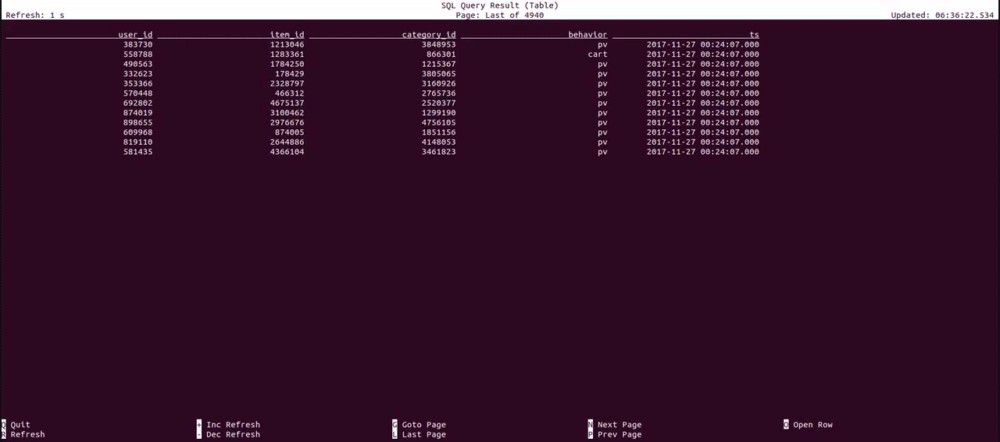
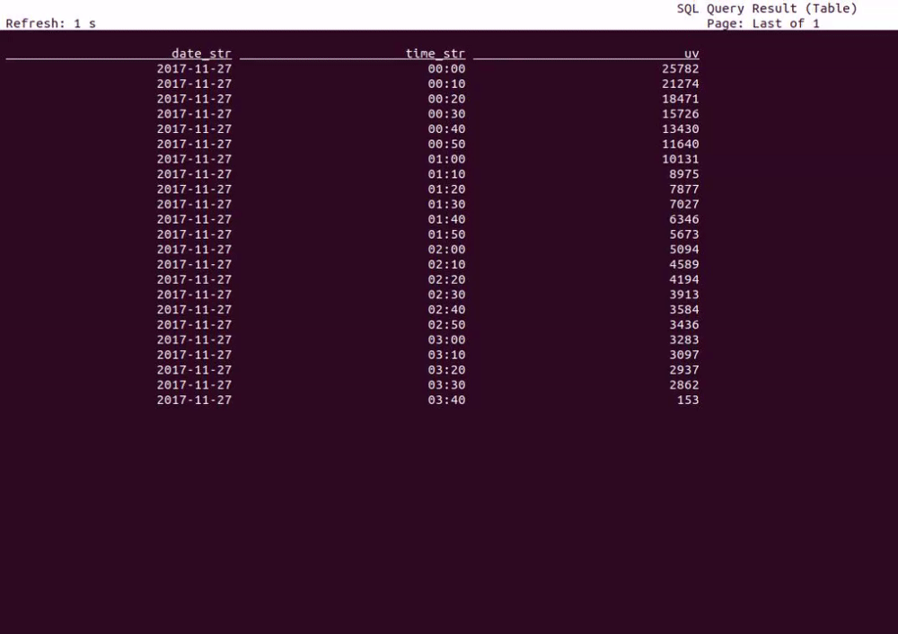
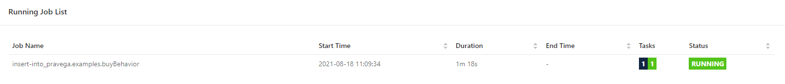
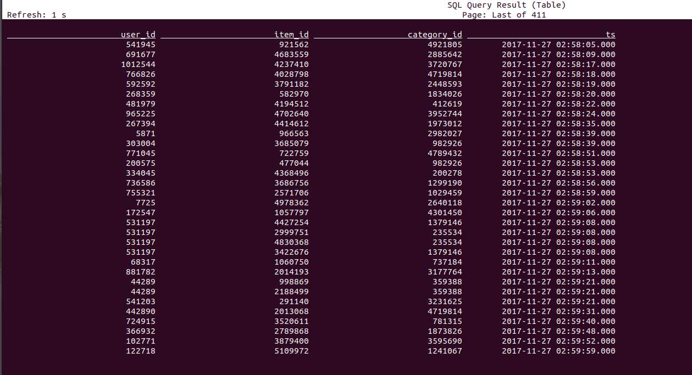

# Flink-Catalog-Demo

In this demo we will show how Flink SQL is using Pravega as an external, persistent catalog and processing data from Pravega.
All exercises are performed in the Flink SQL CLI, 
and the entire process uses standard SQL syntax, without a single line of Java/Scala code or IDE installation.

This demo is inspired by @wuchong's excellent work. [Flink-SQL demo](https://flink.apache.org/2020/07/28/flink-sql-demo-building-e2e-streaming-application.html)

## Prerequsites

Prepare a Linux or MacOS computer with Docker installed.

### Get the data
The dataset we are using is from the Alibaba Cloud Tianchi public dataset. It contains the user behavior on the day of November 27, 2017 (behaviors include “click”, “like”, “purchase” and “add to shopping cart” events). Each row represents a user behavior event, with the user ID, product ID, product category ID, event type, and timestamp.
Please download the demo data from [Google Drive](https://drive.google.com/file/d/1P4BAZnpCY-knMt5HFfcx3onVjykYt3et/view?usp=sharing) and move it into the `./datagen` folder (as `./data/user_behavior.log`).

The folder will be mounted by the Docker containers.

### Starting the Demo Environment

The components required in this demo are all managed in containers, so we will use docker-compose to start them.

#### Download Pravega connectors library

To intergerate Flink and Pravega, we need pravega-connectors-flink jar files. Go to https://github.com/pravega/flink-connectors/packages/910737
and download the latest jar file on the right side of the page. Make sure to download the correct file and move it into `./sql-client/lib` 
folder (as `./sql-client/lib/pravega-connectors-flink-1.13_2.12-{VERSION}.jar`). (This may require github login.)

#### Build the Docker Images
```
docker-compose build
```

#### Start the Docker Compose Environment

The Docker Compose environment consists of the following containers:
- **Flink SQL Client**: used to submit queries and visualize their results.
- **Flink Cluster**: a Flink JobManager container and a Flink TaskManager container to execute queries.
- **DataGen**: the data generator. By default it will send 1000 data per second, lasting for about 3 hours. You can also
  modify the `speedup` parameter in `docker-compose.yml` to adjust the data generatoring speed. It will first register the
  schema to Pravega schema registry service and then send the generated data to Pravega cluster automatically.
- **Pravega**: used as streaming data storage. Data generatored by Datagen container will be sent to Pravega. 
  And the data stored in Pravega will be sent to Flink as a data source using [Pravega-Flink connector](https://github.com/pravega/flink-connectors).
- **Schema Registry**: the registry service to store and manage schemas for the unstructured data stored in Pravega streams.

To start all containers, run the following command in the directory that contains the docker-compose.yml file.
```
docker-compose up -d
```
This command automatically starts all the containers defined in the Docker Compose configuration in a detached mode. 
Run docker ps to check whether the 6 containers are running properly. You can also visit http://localhost:8081/ to see if Flink is running normally.

Finally, you can use the following command to stop all the containers after you finished the tutorial.
`docker-compose down`

## The Demo

### Start the SQL Client
To enter the SQL CLI client run:
```
docker-compose exec sql-client ./sql-client.sh
```
The command starts the SQL CLI client in the container. You should see the welcome screen of the CLI client:
```
                                   ▒▓██▓██▒
                               ▓████▒▒█▓▒▓███▓▒
                            ▓███▓░░        ▒▒▒▓██▒  ▒
                          ░██▒   ▒▒▓▓█▓▓▒░      ▒████
                          ██▒         ░▒▓███▒    ▒█▒█▒
                            ░▓█            ███   ▓░▒██
                              ▓█       ▒▒▒▒▒▓██▓░▒░▓▓█
                            █░ █   ▒▒░       ███▓▓█ ▒█▒▒▒
                            ████░   ▒▓█▓      ██▒▒▒ ▓███▒
                         ░▒█▓▓██       ▓█▒    ▓█▒▓██▓ ░█░
                   ▓░▒▓████▒ ██         ▒█    █▓░▒█▒░▒█▒
                  ███▓░██▓  ▓█           █   █▓ ▒▓█▓▓█▒
                ░██▓  ░█░            █  █▒ ▒█████▓▒ ██▓░▒
               ███░ ░ █░          ▓ ░█ █████▒░░    ░█░▓  ▓░
              ██▓█ ▒▒▓▒          ▓███████▓░       ▒█▒ ▒▓ ▓██▓
           ▒██▓ ▓█ █▓█       ░▒█████▓▓▒░         ██▒▒  █ ▒  ▓█▒
           ▓█▓  ▓█ ██▓ ░▓▓▓▓▓▓▓▒              ▒██▓           ░█▒
           ▓█    █ ▓███▓▒░              ░▓▓▓███▓          ░▒░ ▓█
           ██▓    ██▒    ░▒▓▓███▓▓▓▓▓██████▓▒            ▓███  █
          ▓███▒ ███   ░▓▓▒░░   ░▓████▓░                  ░▒▓▒  █▓
          █▓▒▒▓▓██  ░▒▒░░░▒▒▒▒▓██▓░                            █▓
          ██ ▓░▒█   ▓▓▓▓▒░░  ▒█▓       ▒▓▓██▓    ▓▒          ▒▒▓
          ▓█▓ ▓▒█  █▓░  ░▒▓▓██▒            ░▓█▒   ▒▒▒░▒▒▓█████▒
           ██░ ▓█▒█▒  ▒▓▓▒  ▓█                █░      ░░░░   ░█▒
           ▓█   ▒█▓   ░     █░                ▒█              █▓
            █▓   ██         █░                 ▓▓        ▒█▓▓▓▒█░
             █▓ ░▓██░       ▓▒                  ▓█▓▒░░░▒▓█░    ▒█
              ██   ▓█▓░      ▒                    ░▒█▒██▒      ▓▓
               ▓█▒   ▒█▓▒░                         ▒▒ █▒█▓▒▒░░▒██
                ░██▒    ▒▓▓▒                     ▓██▓▒█▒ ░▓▓▓▓▒█▓
                  ░▓██▒                          ▓░  ▒█▓█  ░░▒▒▒
                      ▒▓▓▓▓▓▒▒▒▒▒▒▒▒▒▒▒▒▒▒▒▒▒▒▒▒▒▒▒░░▓▓  ▓░▒█░

    ______ _ _       _       _____  ____  _         _____ _ _            _  BETA   
   |  ____| (_)     | |     / ____|/ __ \| |       / ____| (_)          | |  
   | |__  | |_ _ __ | | __ | (___ | |  | | |      | |    | |_  ___ _ __ | |_
   |  __| | | | '_ \| |/ /  \___ \| |  | | |      | |    | | |/ _ \ '_ \| __|
   | |    | | | | | |   <   ____) | |__| | |____  | |____| | |  __/ | | | |_
   |_|    |_|_|_| |_|_|\_\ |_____/ \___\_\______|  \_____|_|_|\___|_| |_|\__|

        Welcome! Enter 'HELP;' to list all available commands. 'QUIT;' to exit.


Flink SQL>
```

### Create Pravega Catalog with DDL
First we need to create a Pravega Catalog to access the data stored in Pravega.
In order to use Pravega Catalog, we need to add schema registry group and register the schema of your serialization format to schema registry service. This procedure was done in the datagen container: 
```java
// add schema registry group
GroupProperties groupProperties = new GroupProperties(SerializationFormat.Avro, Compatibility.allowAny(), false);
try (SchemaRegistryClient client = SchemaRegistryClientFactory.withNamespace(DEFAULT_SCOPE, schemaRegistryClientConfig)) {
    if (!schemaGroupExist(client, DEFAULT_STREAM)) {
        client.addGroup(DEFAULT_STREAM, groupProperties);
    }
} catch (Exception e) {
    System.out.printf("Meet error when adding schema registry group", e);
    throw e;
}

// register schema to schema registry
DataType dataType =
        ROW(
                FIELD("user_id", STRING()),
                FIELD("item_id", STRING()),
                FIELD("category_id", STRING()),
                FIELD("behavior", STRING()),
                FIELD("ts", TIMESTAMP(3))).notNull();
Schema avroSchema = AvroSchemaConverter.convertToSchema(dataType.getLogicalType());
SerializerConfig serializerConfig = SerializerConfig.builder()
        .registryConfig(schemaRegistryClientConfig)
        .namespace(DEFAULT_SCOPE)
        .groupId(DEFAULT_STREAM)
        .registerSchema(true)
        .build();
Serializer<GenericRecord> serializer = SerializerFactory.avroSerializer(serializerConfig, AvroSchema.ofRecord(avroSchema));
```

Then the datagen container will send data to `testSteam` stream in `examples` scope of Pravega. 
Pravega will send data to Flink as a data source by Pravega Flink connector. 

Pravega `scope` is mapped to Flink catalog `database` while Pravega `stream` is mapped to Flink catalog `table` automatically 
so that we don't need to manually rewrite DDLs to create tables.
We run the following DDL statement in SQL CLI to create a Flink catalog that connects to Pravega and schema-registry.
We will use Avro as the format for serialization in table sink as predefined in datagen, while Json is also another available
format.

```sql
CREATE CATALOG pravega WITH(
    'type' = 'pravega',                                     --Flink catalog type
    'controller-uri' = 'tcp://pravega:9090',                --Pravega controller URI
    'schema-registry-uri' = 'http://schemaregistry:9092',   --Schema-Registry service URI
    'default-database' = 'examples',                        --Flink catalog database, mapped to Pravega scope
    'serialization.format' = 'Avro'                         --data serialization format
);
```

### Show Tables

After creating the `pravega` catalog in SQL CLI, we can check the tables in Pravega catalog: 
```sql
USE CATALOG pravega;
SHOW TABLES;
DESCRIBE userBehavior;
SELECT * FROM userBehavior;
```



### Running queries

We run a query of unique visitors (UV) where the number of UV at 10:00 represents the total number of UV from 00:00 to 10:00. 
We need 3 columns in this case: date, time and cumulative UVs.

We can extract the date and time using `DATE_FORMAT` function based on the `ts` field. As the section title describes, 
we only need to report every 10 minutes. So, we can use SUBSTR and the string concat function || to convert 
the time value into a 10-minute interval time string, such as `12:00`, `12:10`. Next, we group data by `date_str` and
perform a `COUNT DISTINCT` aggregation on `user_id` to get the current cumulative UV in this day. 
Additionally, we perform a `MAX` aggregation on `time_str` field to get the current stream time: 
the maximum event time observed so far. As the maximum time is also a part of the primary key of the sink, 
the final result is that we will insert a new point into the elasticsearch every 10 minute. 
And every latest point will be updated continuously until the next 10-minute point is generated.
```sql
SELECT date_str, time_str, COUNT(DISTINCT user_id) as uv
FROM (
   SELECT
     DATE_FORMAT(ts, 'yyyy-MM-dd') as date_str,
     SUBSTR(DATE_FORMAT(ts, 'HH:mm'),1,4) || '0' as time_str,
     user_id
   FROM userBehavior)
GROUP BY date_str;
```


### Write data to Pravega

With the help of catalog, we can also easily write data back to Pravega.

First let's create a table to store all buy behavior transaction between 0:00 to 03:00 everyday.
```sql
CREATE TABLE buyBehavior (
    user_id STRING,
    item_id STRING,
    category_id STRING,
    ts TIMESTAMP(3)
);
```
Then we write query results into table, it will create a stream with table name in Pravega:
```sql
INSERT INTO buyBehavior
SELECT user_id, item_id, category_id, ts
FROM userBehavior
WHERE behavior = 'buy' AND HOUR(ts) <= 2;
```

Check result in Pravega:
```
docker-compose exec pravega bin/pravega-cli stream read examples/buyBehavior
```

We can also check by querying in the sql client:
```
SELECT * FROM buyBehavior
```



## Conclusion
The demo provides some clear and practical examples of the convenience and power of catalogs, featuring an easy connection to Pravega.
It enables us to reference existing metadata in Pravega and automatically maps them to Flink's corresponding metadata easily so that
we don't have to re-write DDLs in Flink when accessing data. 
The catalog greatly simplifies steps required to get started with Flink with Pravega, and greatly enhanced user experiences.