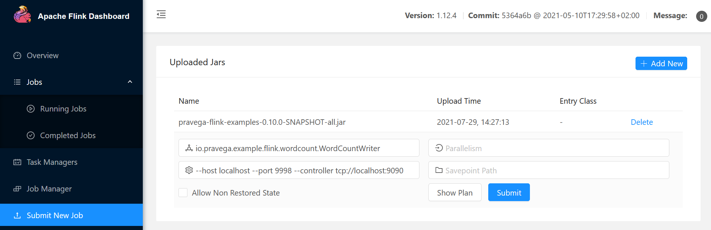
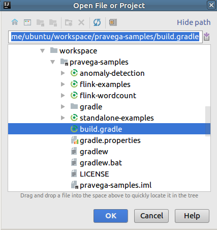
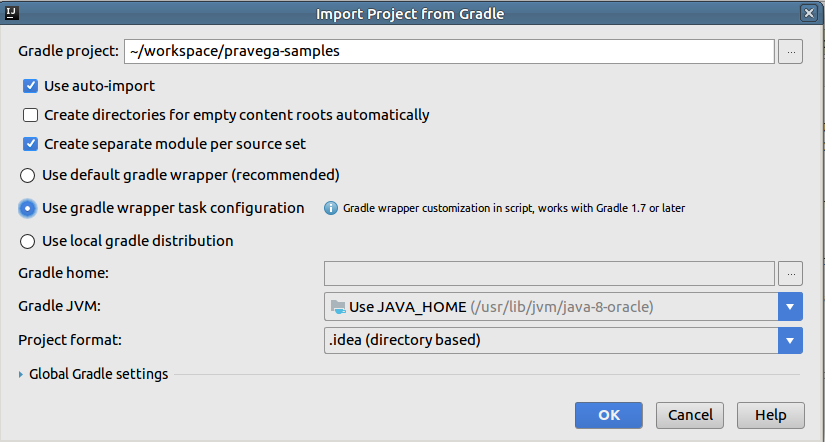
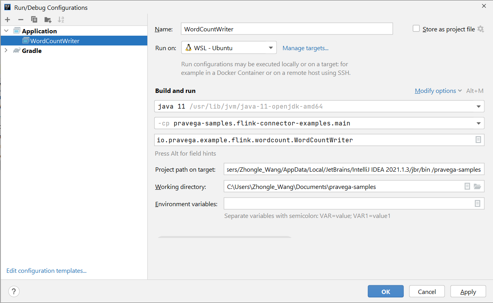

# Word Count Example Using Pravega Flink Connectors
This example consists of two applications, a `WordCountWriter` that reads data from a 
network stream, transforms the data, and writes the data to a Pravega stream; and a
`WordCountReader` that reads from a Pravega stream and prints the word counts summary.

The scripts can be found under the flink-examples directory in:
```
flink-connector-examples/build/install/pravega-flink-examples/bin
```
You might want to run `WordCountWriter` in one window and `WordCountReader` in another.


## Start WordCountWriter
The application reads text from a socket, once every 5 seconds prints the distinct words and counts from the previous 5 seconds, and writes the word counts to a Pravega stream and prints word counts.

First, use `netcat` to start local server via
```
$ nc -lk 9998
```

Then start the `WordCountWriter`:
```
$ bin/wordCountWriter [-host localhost] [-port 9998] [-scope examples] [-stream wordcount] [-controller tcp://localhost:9090]
```

All args are optional, if not specified, the defaults are:

 * host - "localhost"
 * port - "9998"
 * scope - "examples" 
 * stream - "wordcount"
 * controller - "tcp://localhost:9090"

## Start WordCountReader
The application reads data from a Pravega stream and prints the data.
```
$ bin/wordCountReader [-scope examples] [-stream wordcount] [-controller tcp://localhost:9090]
```
All args are optional, if not included, the defaults are:
 * scope - "examples"
 * stream - "wordcount"
 * controller - "tcp://localhost:9090"

Now in the windows where `netcat` is running, enter some text, for example,
```
$ nc -lk 9998
aa bb cc aa
```

In the windows where `WordCountReader` is running, it should show output similar to the sample output below
```
4> Word: cc:  Count: 1
4> Word: aa:  Count: 2
4> Word: bb:  Count: 1
```
 
## Run In Flink Environment

### Start Flink

Follow the instruction [here](https://ci.apache.org/projects/flink/flink-docs-stable/docs/deployment/resource-providers/standalone/overview/) to download and start Flink.

Suppose Flink is installed at /usr/share/flink. Before starting Flink you will need to edit /usr/share/flink/conf/flink-conf.yaml to increase the number of task slots, for example, 4.
```
taskmanager.numberOfTaskSlots: 4
```

By default, Flink job manager rest API runs on port 8081 to receive job submission, and it is configurable via `rest.port`.

Point your browser to `http://<your_flink_host>:8081` to make sure Flink is running, then click "Running Jobs".

### Start WordCountWriter

```bash
$ cd flink-connector-examples/build/install/pravega-flink-examples
$ flink run -c io.pravega.example.flink.wordcount.WordCountWriter lib/pravega-flink-examples-<VERSION>-all.jar --host localhost --port 9998 --controller tcp://localhost:9090
```

The `WordCountWriter` job should show up on the Flink UI as a running job.

### Start WordCountReader

In a different window:

```bash
$ cd flink-connector-examples/build/install/pravega-flink-examples
$ flink run -c io.pravega.example.flink.wordcount.WordCountReader lib/pravega-flink-examples-<VERSION>-all.jar --controller tcp://localhost:9090
```

The `WordCountReader` job should show up on the Flink UI as a running job.

### View Output
Now in the windows where `netcat` is running, enter some text, for example,

```bash
$ nc -lk 9998
aa bb cc aa
```

Output similar to the sample below should show up in a flink taskmanager output file, e.g., flink-ubuntu-taskmanager-0-myhostname.out, in the flink log directory, e.g., /usr/share/flink/log

The output is also available in the UI. Follow the path `Task Managers` -> `the task manager` -> `Stdout`.
You should see the output in the textarea.

```
Word: aa:  Count: 2
Word: cc:  Count: 1
Word: bb:  Count: 1
```

### Submit Jobs on Flink UI

You can also submit flink jobs via Flink UI.

Submit `WordCountWriter` job

- Click **Submit new Job**
- Click the **Add New** button
- Browser to `flink-connector-examples/build/install/pravega-flink-examples/lib` and select the uber jar file: `pravega-flink-examples-<VERSION>-**all**.jar`
- Click the **Upload** button
- Click the uploaded jar file
- In the **Entry Class** field, enter: ```io.pravega.example.flink.wordcount.WordCountWriter```
- In the **Program Arguments** field, enter: ```--host localhost --port 9998 --controller tcp://localhost:9090```
- Click the **Submit** button



Submit `WordCountReader` job

Repeat the steps above except
- in the **Entry Class** field, enter: ```io.pravega.example.flink.wordcount.WordCountReader```
- in the **Program Arguments** field, enter: ```--controller tcp://localhost:9090```

## IDE Setup
### IntelliJ
- File Open
- Browse to pravega-examples folder
- Select **build.gradle**, then click **OK**
- Click **Open as Project**
- Choose **Use Auto-import**, and **Use gradle wrapper task configuration**, then click **OK**





- Run Configuration for `WordCountWriter`


## Contributors ##
* [Kartik Vandra](https://github.com/kvandra)   
* [Lida He](https://github.com/hldnova)   
