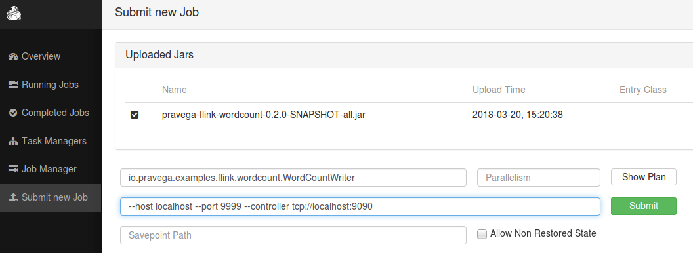

# Word Count Example Using Pravega Flink Connectors
This example demonstrates how to use the Pravega Flink Connectors to write data collected from an external network stream into a Pravega stream and read the data from the Pravega stream.

## Pre requisites
1. Java 8
2. Pravega running (see [here](http://pravega.io/docs/latest/getting-started/) for instructions)

## Build Pravega Flink Connectors

Follow the below steps to build and publish artifacts from source to local Maven repository:

```
$ git clone https://github.com/pravega/flink-connectors.git
$ cd flink-connectors
$ ./gradlew clean install
```

## Build the Sample Code

Follow the below steps to build the sample code:

```
$ git clone https://github.com/pravega/pravega-samples.git
$ cd pravega-samples
$ ./gradlew clean installDist
```

## Run Word Count Sample
This example consists of two applications, a WordCountWriter that reads data from a network stream, transforms the data, and writes the data to a Pravega stream; and a WordCountReader that reads from a Pravega stream and prints the word counts summary. You might want to run WordCountWriter in one window and WordCountReader in another.

The scripts can be found under the flink-wordcount directory in:
```
flink-wordcount/build/install/pravega-flink-wordcount/bin
```

### Start WordCountWriter
The application reads text from a socket, once every 5 seconds prints the distinct words and counts from the previous 5 seconds, and writes the word counts to a Pravega stream and prints word counts.

First, use netcat to start local server via
```
$ nc -lk 9999
```

Then start the WordCountWriter
```
$ bin/wordCountWriter [-host localhost] [-port 9999] [-stream myscope/wordcount] [-collector tcp://localhost:9090]
```

All args are optional, if not specified, the defaults are:

 * host - "localhost"
 * port - "9999"
 * stream - "myscope/wordcount"
 * controller - "tcp://localhost:9090"

### Start WordCountReader
The application reads data from a Pravega stream and prints the data.
```
$ bin/wordCountReader [-stream myscope/wordcount] [-collector tcp://localhost:9090]
```
All args are optional, if not included, the defaults are:
 * stream - "myscop/wordcount"
 * controller - "tcp://localhost:9090"

Now in the windows where netcat is running, enter some text, for example,
```
$ nc -lk 9999
aa bb cc aa
```

In the windows where wordCountReader is running, it should show output similar to the sample output below
```
4> Word: cc:  Count: 1
4> Word: aa:  Count: 2
4> Word: bb:  Count: 1
```
 
## Run In Flink Environment

### Start Flink

Follow the instruction [here](https://ci.apache.org/projects/flink/flink-docs-release-1.4/quickstart/setup_quickstart.html) to download and start Flink. 

Suppose Flink is installed at /usr/share/flink. Before starting Flink you will need to edit /usr/share/flink/conf/flink-conf.yaml to increase the number of task slots, for example, 4.
```
taskmanager.numberOfTaskSlots: 4
```

By default, Flink job manager runs on port 6123.

Point your browser to http://<your_flink_host>:8081 to make sure Flink is running; then click "Running Jobs"

### Start WordCountWriter
```
$ cd flink-wordcount/build/install/pravega-flink-wordcount
$ flink run -m localhost:6123 -c io.pravega.examples.flink.wordcount.WordCountWriter lib/pravega-flink-wordcount-0.2.0-SNAPSHOT-all.jar --host localhost --port 9999 --controller tcp://localhost:9090
```
The WordCountWriter job should show up on the Flink UI as a running job.

### Start WordCountReader
In a different window
```
$ cd flink-wordcount/build/install/pravega-flink-wordcount
$ flink run -m localhost:6123 -c io.pravega.examples.flink.wordcount.WordCountReader lib/pravega-flink-wordcount-0.2.0-SNAPSHOT-all.jar --controller tcp://localhost:9090
```
The WordCountReader job should show up on the Flink UI as a running job.

### View Output
Now in the windows where netcat is running, enter some text, for example,
```
$ nc -lk 9999
aa bb cc aa
```

Output similar to the sample below should show up in a flink taskmanager output file, e.g., flink-ubuntu-taskmanager-0-myhostname.out, in the flink log directory, e.g., /usr/share/flink/log
```
Word: aa:  Count: 2
Word: cc:  Count: 1
Word: bb:  Count: 1
```

### Submit Jobs on Flink UI

You can also submit flink jobs via Flink UI.

Submit WordCountWriter job

- Click **Submit new Job**
- Click **Add New** button
- Browser to flink-wordcout/build/install/pravega-flink-wordcount/lib and select the uber jar file: pravega-flink-wordcount-0.2.0-SNAPSHOT-**all**.jar
- Click **Upload** button
- Click the checkbox next to the uploaded jar file.
- In the **Entry Class** field, enter: ```io.pravega.examples.flink.wordcount.WordCountWriter```
- In the **Program Arguments** field, enter: ```--host localhost --port 9999 --controller tcp://localhost:9090```
- Click **Submit** button



Submit WordCountReader job

Repeat the steps above except
- in the **Entry Class** field, enter: ```io.pravega.examples.flink.wordcount.WordCountReader```
- in the **Program Arguments** field, enter: ```--controller tcp://localhost:9090```
