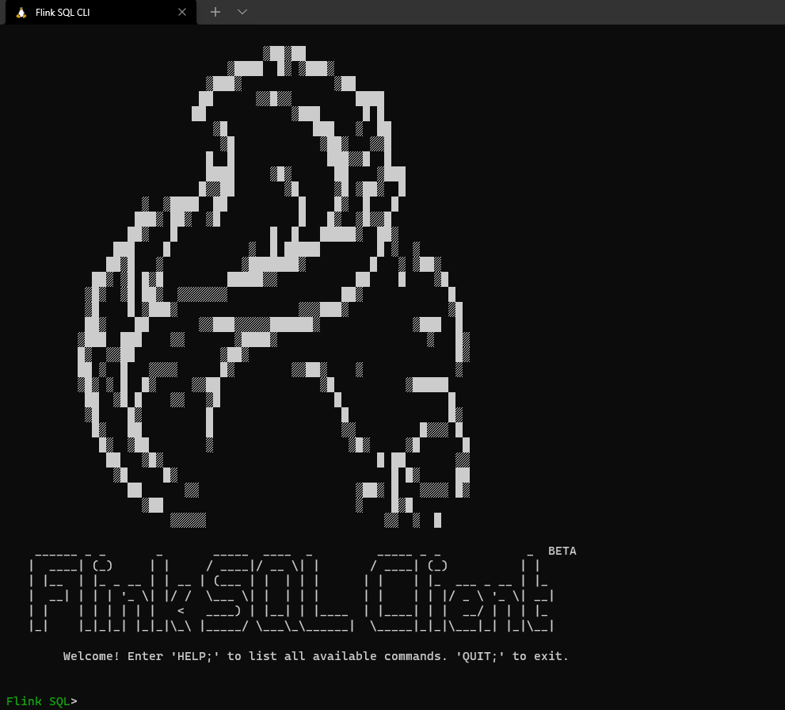
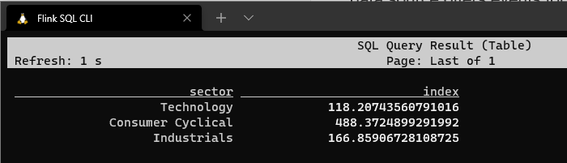

# Pravega CDC Demo

This page demonstrates how to preserve the CDC (change data capture) from MySQL into Pravega and consume them in Flink.

> Change data capture (CDC) is used to determine and track the data that has changed so that actions can be taken using the changed data. It is often used in data-warehouse environments where we want have a copy or log of the existing data.

We use Pravega as the streaming storage system which can preserve the continuous data stream, so the change data can be both written to and read from a durable, elastic and consistent place. Also, the debezium json format is used as the intermediate format when we transfer the data. You may have a look at [Pravega](https://cncf.pravega.io/) and [Debezium](https://debezium.io/) respectively at their homepage.

## Preparation

The demo runs under `docker-compose`, so a Linux or Windows (WSL2) environment is required.

With `docker` enabled, download the [`docker-compose.yml`](./docker-compose.yml) and put it anywhere you like.

After having the `docker-compose.yml`, start it like this:

```bash
docker-compose up -d
```

This command automatically starts all the containers defined in the docker compose configuration in the detached mode. Run `docker ps` if you wish to check whether the 7 containers are running properly. `http://localhost:12081/` is also available for Flink UI.

The docker compose environment consists of the following containers:

- Flink SQL CLI: Used to submit queries and visualize the results.
- Flink Cluster: A Flink JobManager and a Flink TaskManager container to execute queries.
- MySQL: MySQL 8 with some pre-populated tables in the database.
- Pravega: Preserve the MySQL change data.
- Debezium: Capture the MySQL change data and sink them to Pravega.
- DataGen: The data generator. After the container is started, stock data from the previous 5 days are pulled and updated to the MySQL. They are accelerated to be finished 5 days change into half an hour.

You may stop the containers at any time by `Ctrl-C` and they can be totally removed with:

```bash
docker-compose down
```

## What happen in the data source

**TL;DR** A datagen that update prices in the stock market table.

The datagen container continuously update stock data in the MySQL table. It contains 8 selected companies and there corresponding sector. Each company stock lasts 5 days with 1 minute interval. All of them comes from [*Yahoo Finance*](https://github.com/ranaroussi/yfinance).

If you follows the log of `datagen` container via `docker-compose logs datagen`, similar outputs should seen below:

```
datagen_1            | Wait 30 seconds.
datagen_1            | Create scope and stream for pravega.
datagen_1            | Get stock data.
[*********************100%***********************]  8 of 8 completed
datagen_1            | Update MySQL.
datagen_1            | Update ['AAPL', 'IBM', 'MU', 'BA', 'TSLA', 'NKE', 'GE', 'MMM'] with [140.53799438476562, 140.3217010498047, 66.94000244140625, 223.72000122070312, 808.811279296875, 154.14999389648438, 102.36000061035156, 175.1750030517578]
datagen_1            | Update ['AAPL', 'IBM', 'MU', 'BA', 'TSLA', 'NKE', 'GE', 'MMM'] with [140.8000030517578, 140.3000030517578, 66.95059967041016, 223.74569702148438, 809.3300170898438, 154.47000122070312, 101.87000274658203, 175.4199981689453]
datagen_1            | Update ['AAPL', 'IBM', 'MU', 'BA', 'TSLA', 'NKE', 'GE', 'MMM'] with [140.3699951171875, 140.54420471191406, 66.91999816894531, 223.55999755859375, 808.219970703125, 154.6699981689453, 102.2300033569336, 175.75999450683594]
```

> The actual numbers may vary.

After the MySQL server is ready, it will update the stock data every second.

On the MySQL side, two simple table are pre-populated so `UPDATE` command runs smoothly.

```sql
CREATE TABLE stock (
    id VARCHAR(10) NOT NULL PRIMARY KEY,
    value DOUBLE NOT NULL
);

CREATE TABLE metadata (
    id VARCHAR(10) NOT NULL PRIMARY KEY,
    sector VARCHAR(255) NOT NULL
);
```

That's it, let's head into change data capture.

## Capture the change data

**TL;DR** Store the change log captured by Debezium in Pravega.

> [*Debezium*](https://debezium.io/) is an open source distributed platform for change data capture. Start it up, point it at your databases, and your apps can start responding to all of the inserts, updates, and deletes that other apps commit to your databases.

The Debezium will start after MySQL is ready for any operation. As soon as the data is updated in the MySQL table, the Debezium server will read the binlog from MySQL and sink the change log to Pravega, a reliable stream storage system, where these change log are preserved.

A successful deployment will result the change log data similar like this:

```bash
$  docker-compose exec pravega ./bin/pravega-cli stream read stock/dbserver1.stock.stock
{"before":{"id":"AAPL","value":140.69000244140625},"after":{"id":"AAPL","value":140.5850067138672},"source":{"version":"1.7.0.Final","connector":"mysql","name":"dbserver1","ts_ms":1634716546000,"snapshot":"false","db":"stock","sequence":null,"table":"stock","server_id":1,"gtid":null,"file":"binlog.000002","pos":24961,"row":0,"thread":null,"query":null},"op":"u","ts_ms":1634716546543,"transaction":null}
{"before":{"id":"IBM","value":140.94000244140625},"after":{"id":"IBM","value":140.73500061035156},"source":{"version":"1.7.0.Final","connector":"mysql","name":"dbserver1","ts_ms":1634716546000,"snapshot":"false","db":"stock","sequence":null,"table":"stock","server_id":1,"gtid":null,"file":"binlog.000002","pos":25272,"row":0,"thread":null,"query":null},"op":"u","ts_ms":1634716546544,"transaction":null}
{"before":{"id":"MU","value":67.13999938964844},"after":{"id":"MU","value":67.12999725341797},"source":{"version":"1.7.0.Final","connector":"mysql","name":"dbserver1","ts_ms":1634716546000,"snapshot":"false","db":"stock","sequence":null,"table":"stock","server_id":1,"gtid":null,"file":"binlog.000002","pos":25581,"row":0,"thread":null,"query":null},"op":"u","ts_ms":1634716546544,"transaction":null}
```

> We read change log directly from Pravega.
>
> Each field's meaning can be learned from [Debezium documentation](https://debezium.io/documentation/reference/1.7/connectors/mysql.html#mysql-connector-events_debezium).

These are typical update operations that generated by Debezium from MySQL's binlog and they are written into Pravega. We can tell what the value before the update and the value after it. Also, the `op` field indicates what the operation it is. (`r` for read, `u` for update, `c` for insert and `d` for delete).

Now it's time to consume them.

## Consume data

Open the Flink SQL CLI client via:

```bash
docker-compose exec flink-sql-client ./bin/sql-client.sh embedded -l ./lib
```

> Note this client runs on [`pravega-connectors-flink`](https://github.com/pravega/flink-connectors) and a pre-defined configuration.

You should see the welcome screen of the CLI client.



In order to make the events in the Pravega accessible to Flink SQL, we run the following DDL statement in SQL CLI to create a table that connects to the stream in Pravega:

```sql
CREATE TABLE stock (
    id VARCHAR(10) NOT NULL PRIMARY KEY,
    `value` DOUBLE NOT NULL
) WITH (
    'connector' = 'pravega',  -- indicate to source to be Pravega
    'controller-uri' = 'tcp://pravega:9090',  -- pravega container address
    'scope' = 'stock',  -- scope where the changelog is written to
    'scan.execution.type' = 'streaming',  -- continuous data
    'scan.streams' = 'dbserver1.stock.stock',  -- changelog stream for the stock table
    'format' = 'debezium-json'  -- in debezium format
);

CREATE TABLE metadata (
    id VARCHAR(10) NOT NULL PRIMARY KEY,
    sector STRING NOT NULL
) WITH (
    'connector' = 'jdbc',
    'url' = 'jdbc:mysql://mysql:3306/stock',
    'table-name' = 'metadata',
    'username' = 'root',
    'password' = 'dbz',
    'lookup.cache.max-rows' = '50',
    'lookup.cache.ttl' = '60min'
);
```

The above snippet declares two table with each of them having two fields based on the data format in MySQL. Both of them digest the changelog in Debezium format.

And here comes the final output:

```sql
SELECT sector, avg(`value`) as `index` FROM stock INNER JOIN metadata ON stock.id=metadata.id GROUP BY sector;
```



Finally we can sink them to somewhere we want:

```sql
CREATE TABLE `index` (
    sector STRING NOT NULL,
    `index` DOUBLE NOT NULL
) WITH (
    'connector' = 'blackhole'
);

INSERT INTO `index` SELECT sector, avg(`value`) as `index` FROM stock INNER JOIN metadata ON stock.id=metadata.id GROUP BY sector;
```

🎉 Well done, you've gone through all the parts used in this demo and are definitely be able to build your own big data pipeline with change data capture as the data source.

## Reference

- [Dockerfile for all the containers](https://github.com/pravega/pravega-samples/tree/dev/scenarios/change-data-capture)
- [Debezium tutorial](https://debezium.io/documentation/reference/tutorial.html#updating-database-viewing-update-event)
- [Pravega configuration in Debezium](https://debezium.io/documentation/reference/operations/debezium-server.html#_pravega)
- [Mysql configuration in Debezium](https://debezium.io/documentation/reference/connectors/mysql.html#mysql-example-configuration)
- [Flink debezium format](https://ci.apache.org/projects/flink/flink-docs-stable/docs/connectors/table/formats/debezium/)
