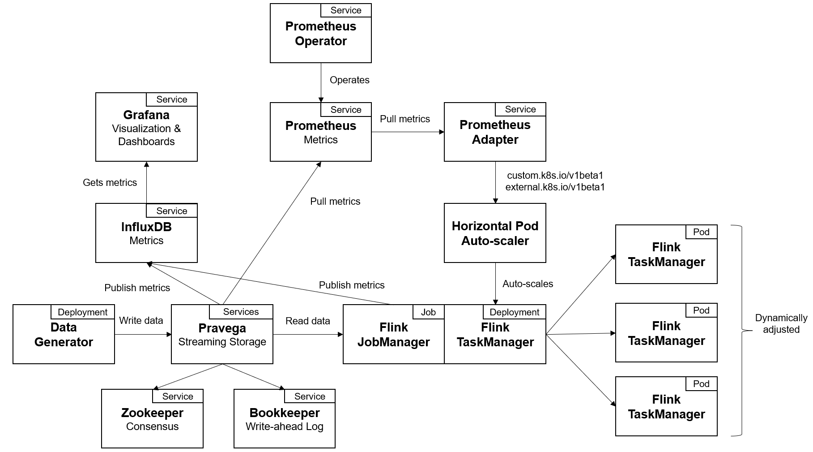
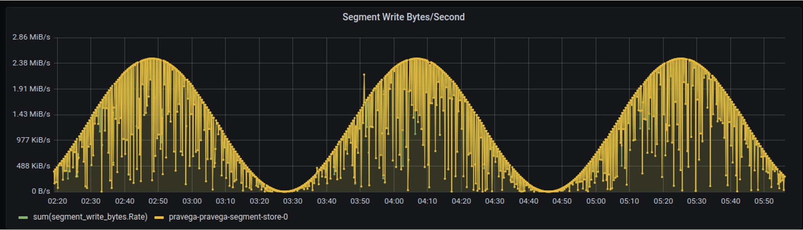
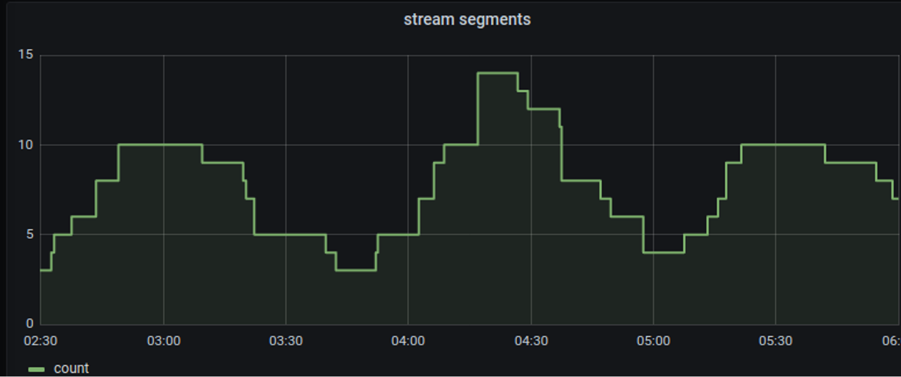
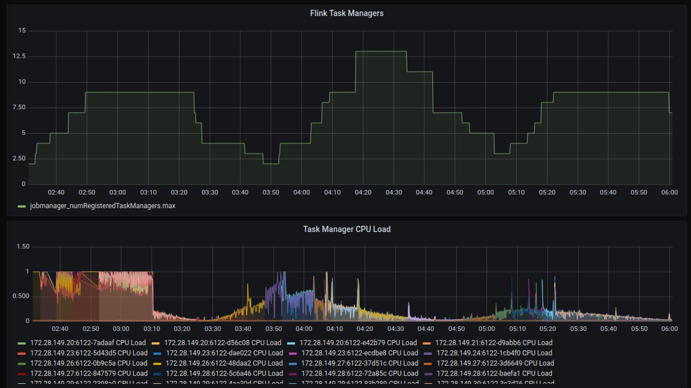

# Scaling Flink automatically on K8S by monitoring Pravega metrics

## Summary
This demo aims to show how [Pravega streams can 
auto-scale](https://cncf.pravega.io/docs/latest/key-features/#auto-scaling)
in coordination with [Flink task 
managers](https://nightlies.apache.org/flink/flink-docs-stable/docs/deployment/elastic_scaling/)
via policies defined in the [Kubernetes Horizontal Pod 
Autoscaler](https://kubernetes.io/docs/tasks/run-application/horizontal-pod-autoscale/) (HPA)
and real time metrics (collected by [Prometheus](https://prometheus.io/)) 
from fluctuating workloads. In this example, we focus on keeping a number 
of Flink task managers equal to the number of Pravega stream segments.
You can watch a video for this demo [here](img%2Fdemo.mp4).

## Components

The diagram below shows the deployment contained in this demo.
First, we have a `Data Generator` application that writes data
to a `Pravega` stream. Such data is continuously read by the `Flink`
service, made of `Job Managers` and `Task Managers`. In parallel,
Pravega exposes metrics to `Prometheus` (and, optionally, it can
also publish metrics to `InfluxDB` if needed). Among the `Pravega`
metrics that `Prometheus` collects, we can find metrics about the
data stream being used in this demo, such as the number of parallel
stream segments. The goal of this demo is to automatically align the
number of parallel segments in a stream with the number of `Flink
Task Managers`. To do so, we also deploy the `Prometheus Adapter`
that exposes `Prometheus` metrics in a consumable way for 
the Kubernetes `Horizontal Pod Auto-scaler`. Given that, we instruct
the Kubernetes `Horizontal Pod Auto-scaler` to keep a one-to-one
relationship between `Flink Task Managers` and stream segments.
Note that `Pravega` stream are elastic, so the number of parallel
segments may change automatically according to the load received
and the scaling policy configured in the stream.



## Deployment


### 1. Build Docker Images

First, we start by building the
docker images for the `Data Generator` and the `Flink Application` that will
be the producer and consumer entities of this demo, respectively.

- Building the `Data Generator`:
```
cd data-generator
../gradlew clean installDist
docker build . -t [YOUR_DOCKER_REGISTRY]/sinusoidal-data-generator:1.0
docker push [YOUR_DOCKER_REGISTRY]/sinusoidal-data-generator:1.0
```

- Building the `Flink Application`:
```
cd flink-application
../gradlew clean installDist
docker build . -t [YOUR_DOCKER_REGISTRY]/flink-busy-reader:1.0
docker push [YOUR_DOCKER_REGISTRY]/flink-busy-reader:1.0
```

### 2. Install Metrics Services and Configuration

Next, we need to install the metrics services. This is required for
both creating the feedback loop that will enable the Kubernetes 
`Horizontal Pod Auto-scaler` to inspect metrics from `Pravega`
data streams, as well as to be able to inspect metrics via dashboards.

- First, let's install `Prometheus Operator`:
```
cd prometheus
kubectl create -f https://raw.githubusercontent.com/prometheus-operator/prometheus-operator/master/bundle.yaml
kubectl create -f rbac-prometheus-operator.yaml
kubectl create -f prometheus.yaml
kubectl create -f controller-monitoring.yaml
```
Note that the last step instructs `Prometheus` to scrape metrics from
`Pravega` controller. This is important to exploit `Pravega` metrics
with Kubernetes `Horizontal Pod Auto-scaler` later on.

- Now, we deploy `InfluxDB` for having `Pravega` and `Flink` metrics
published there:
```
kubectl create deployment influxdb --image=[INFLUX_DB_IMAGE]
kubectl expose pod influxdb --port=8086 --name=influxdb-service
```

- Finally, let's deploy `Grafana`:
```
kubectl create deployment grafana --image=[GRAFANA_IMAGE]
```

### 3. Install Pravega, Bookkeeper, and Zookeeper

Now, we need to install `Pravega` and its dependencies in Kubernetes.
To do so, we refer to the operators pages for the three components needed:
- [Zookeeper Operator](https://github.com/pravega/zookeeper-operator)
- [Bookkeeper Operator](https://github.com/pravega/bookkeeper-operator): Note that
for `Bookkeeper`, you may need to change the default size of storage volumes (10GB) 
to keep the demo running for long time or with a higher workload. For instance, 
if you use the Charts to deploy `Bookkeeper`, this can be configured as follows:
```
helm install bookkeeper pravega/bookkeeper --set replicas=3 --set storage.ledger.volumeSize=250Gi --set storage.journal.volumeSize=250Gi
```
- [Pravega Operator](https://github.com/pravega/pravega-operator): When
deploying `Pravega`, you may need to change the default configuration settings
related to metrics. The goal is to allow `Pravega` to expose metrics to `Prometheus`,
and if needed, also publish metrics to `InfluxDB`. To do so, you may need to change
the following configuration parameters:
```
metrics.statistics.enable: "true"
metrics.influxDB.reporter.enable: "true"
metrics.output.frequency.seconds: "10"
metrics.influxDB.connect.uri: "http://influxdb-service:8086"
controller.metrics.statistics.enable: "true"
controller.metrics.influxDB.reporter.enable: "true"
controller.metrics.output.frequency.seconds: "10"
controller.metrics.influxDB.connect.uri: "http://influxdb-service:8086"
controller.metrics.prometheus.enable: "true"
```

Note that for deploying `Pravega` a long-term storage service is required.
Please, check out the multiple options for long-term storage explained in
[this page](https://github.com/pravega/pravega-operator/blob/master/doc/longtermstorage.md).


### 4. Run Data Generator

Next, we run the `Data Generator` application. Recall to update the
`dataGenerator.yaml` file for pointing to the Docker image you have
built in the first step. Also, you can parameterize some aspects of the
application, such as the stream and scope names, the `Pravega` controller
endpoint, as well as the stream scaling policy rate in events.

- The `Data Generator` application can be deployed as follows:
```
cd data-generator
kubectl apply -f dataGenerator.yaml
```

### 5. Deploy Flink Job
It is time now to deploy the `Flink Application` processing stream
data. Similar to the previous step, recall to update the Docker
image in both `jobmanager-application.yaml` and `taskmanager-job-deployment.yaml`
with the images you have built. You can also parameterize the `Flink Application`
with the `Pravega` endpoint, as well as the computation load you want to
simulate:
```
cd flink-application
kubectl apply -f flink-configuration-configmap.yaml
kubectl apply -f jobmanager-application.yaml
kubectl apply -f jobmanager-service.yaml
kubectl apply -f taskmanager-job-deployment.yaml
```
We provide a couple of scripts for starting up and tiering down `Flink` with
a single command.

### 6. Deploy Kubernetes Pod Auto-scaler

- Finally, we need to integrate the Kubernetes `Horizontal Pod Auto-scaler`
in the deployment. To do so, we first need to install `Prometheus Adapter`:
```
helm repo add prometheus-community https://prometheus-community.github.io/helm-charts
helm repo update
helm install prom-adap prometheus-community/prometheus-adapter -f ./values-prometheus-adapter.yaml
```
Note that in the `values-prometheus-adapter.yaml` we are instructing the `Prometheus
Adapter` to exposing the "segment count" metric for a particular stream: 
`'pravega_controller_segments_count{scope="test",stream="stream",}'`. If you
want to use a different stream or a different metric for triggering
auto-scaling actions, you will need to modify this file.

- Finally, we deploy the Kubernetes `Horizontal Pod Auto-scaler` to auto-scale
the number of `Flink Task Managers` based on the number of stream segments for this
demo:
```
cd hpa-demo
kubectl apply -f hpa-demo.yaml
```

As a result, you should be able to create some dashboards in `Grafana`
to inspect both `Pravega` and `Flink` metrics. At the same time,
you should be able to see a sinusoidal workload being generated by
the `Data Generator` and the number of stream segments changing 
as a result of the change in load and the stream scaling
policy configured. Finally, this should lead to the Kubernetes
`Horizontal Pod Auto-scaler` changing the number of `Flink Task Managers`
according to the number of parallel segments in the stream.
In the following, we provide some `Grafana` dashboard screenshots
demonstrating this:



